# SHU-Combinatorics
# 上海大学-计算机学院-组合数学
# 前言
对上海大学计算机学院的专业选修课-组合数学，给予有关期末考试的一些反馈，希望对你有用。
 本人选修于2023-2024学年的秋季学期。
 建议结合复习课提及的考试范围，以及课程PPT进行针对性复习。
 注：由于每次课程教学内容可能有偏差，所以题型仅供参考。
 注：下述内容仅是为以后学生提供可参考的复习资料，整理内容可能存在表述错误等问题，因此读者复习时遇到问题可自行判断正确与否。

    
 本人复习参考：
 1.由学长整理的那一届复习内容：**[组合数学速成复习资料](https://github.com/Amadeus-1048/Course-Review/tree/main/%E7%BB%84%E5%90%88%E6%95%B0%E5%AD%A6)**
 2.由学长整理的电子资料：**[组合数学PPT及经典考题](https://github.com/1051727403/SHU-CS-Source-Share/tree/main/%E5%AD%A6%E4%B9%A0%E8%B5%84%E6%96%99%EF%BC%88%E9%9D%9E%E7%94%B5%E5%AD%90%E4%B9%A6%EF%BC%89/%E7%BB%84%E5%90%88%E6%95%B0%E5%AD%A6)**

    
 即使不会也要填满答题纸，争取过程分，最后，祝你好运。

    

# 考题类型（回忆版本)

## 第一题(10')
> 经典的排列组合
### 第一小问(5')
> 就是基本的排列组合问题
>  难度不算困难，考虑情况的时候，注意不重复不遗漏即可
### 第二小问(5')
> 圆排列
>  记住公式即可
>  知识点考法：
>  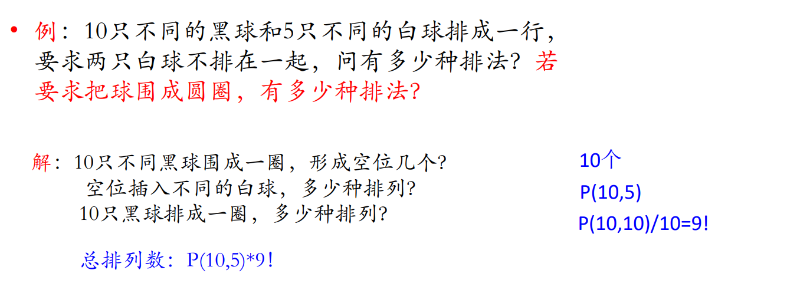

## 第二题(10')
>组合解释，即课上讲的那些方程式，要求自行证明
> 要求通过举个例子的方式，来说明该方程式成立
> 建议考前把PPT上的那些方程式推一遍
>  知识点考法：
>  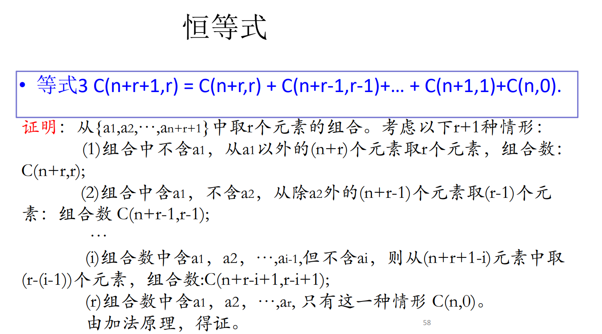

## 第三题(10')
> 母函数-组合型
### 第一小问(5')
> 用母函数的两个基础公式，推另一个基础公式
>  即由a{k(k+1)}减去a{k}，推得a{k^2}
>  考察知识点：
>  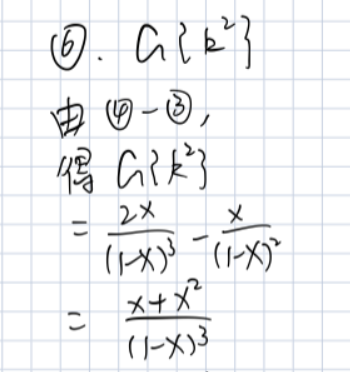
### 第二小问(5')
> 应用题，相当于小建模
>  题型参考课程原题
>  知识点考法：
>  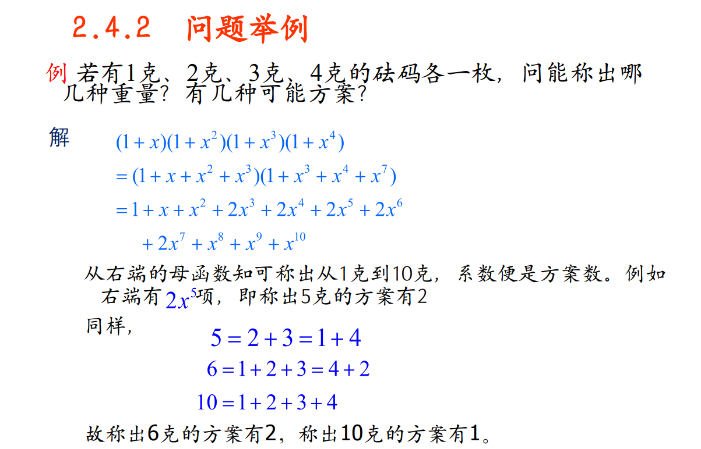

## 第四题(10')
>母函数-排列型

## 第五题(10')
>递推关系（非递归）

## 第六题(7')
>鸽巢原理，证明题
> 题型参考课程原题
>  知识点考法：
>  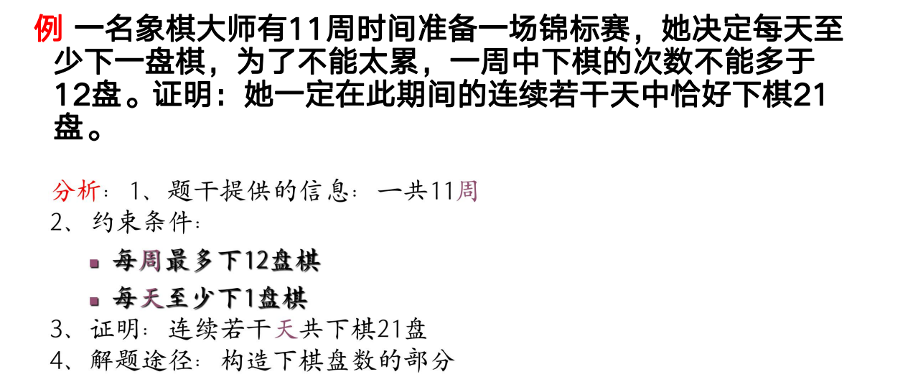
> 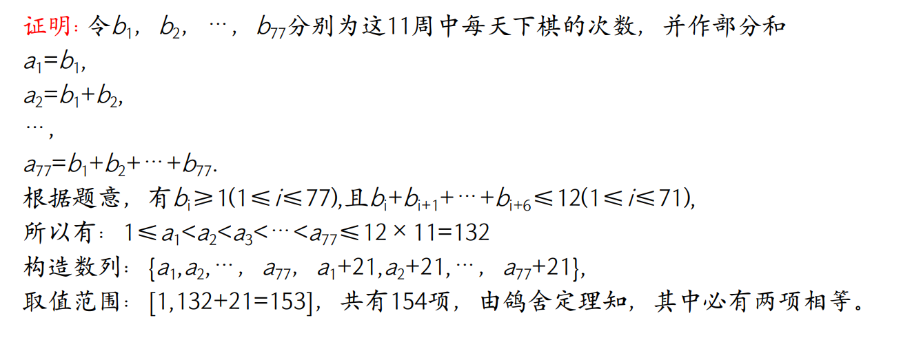
> 

## 第七题(8')
>错排问题
> 记住重排公式即可
> 留意下求的是概率还是可能数量
>  知识点考法：
>  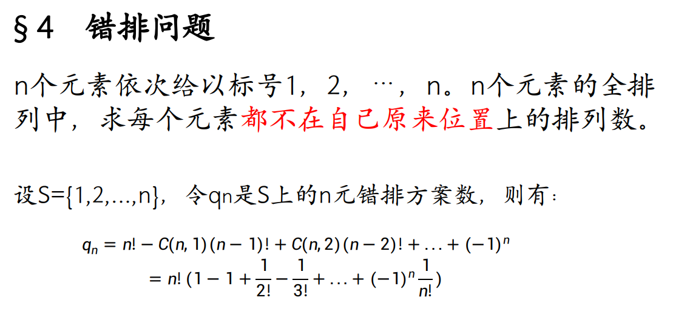
>  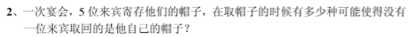
>  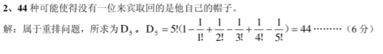

## 第八题(10')
>鸽巢原理-Ramsey数
### 第一小问(5')
> 证明有一个同色三角形
>  知识点考法：
>  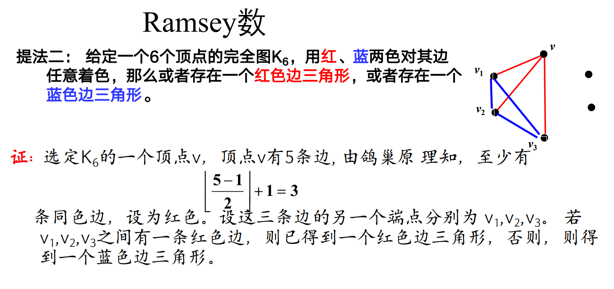
### 第二小问(5')
> 证明有两个同色三角形

## 第九题(9')
>共轭类
> 根据题目所给表示，求对应共轭类的个数
> 代入公式即可求解
>  知识点考法：
>  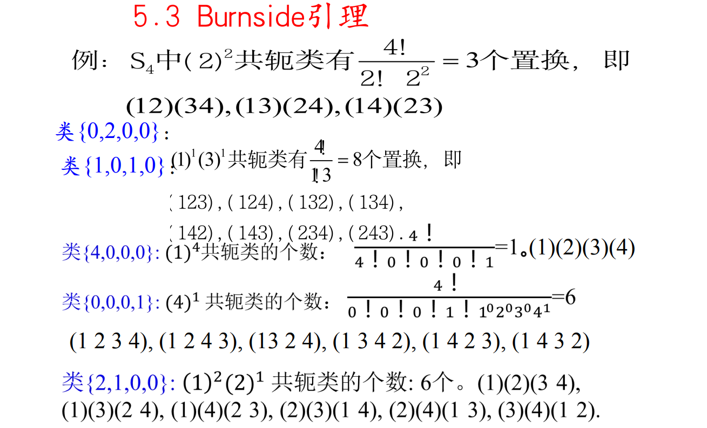

## 第十题(16')
>polya计数定理-着色问题
> 这次考的是正六面体的置换问题
> 正四面体，正六面体各种元素的点，面，棱的转换群全部搞清楚
> 建议考前全推/背一遍：正四面体的点、面、棱，正六面体的点、面、棱
>  知识点考法：
>  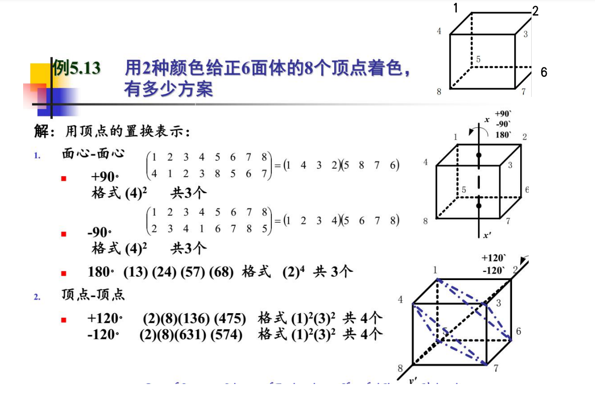
### 第一小问
> 列出正六面体转动群,点/面/棱/的置换表示
### 第二小问
> 根据公式推得着色方案数量
